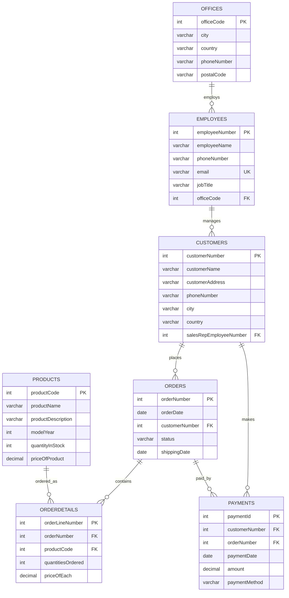

# Entity Relationship Diagram

## Relationship Explanation

- One office can have many employees.
- One employee can manage many customers.
- One customer can place many orders.
- One order can contain many order detail rows.
- One product can appear in many order detail rows.
- One customer can make many payments.
- One order can have zero, one, or many payment records.
